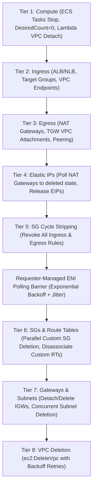

# vpcdrain

> Deterministic, zero-dependency, single-binary Go CLI for tearing down ephemeral AWS VPCs across 8 reverse-topological dependency tiers.

[](https://golang.org)
[](https://github.com/aws/aws-sdk-go-v2)
[](https://opensource.org/licenses/MIT)

---

## Overview

Ephemeral AWS environments (PR preview branches, ephemeral testing VPCs, staging sandboxes) often leave lingering resources that prevent VPC deletion:
- **Circular Security Group Deadlocks**: SG-A allows SG-B, SG-B allows SG-A. AWS returns `DependencyViolation` when attempting to delete either.
- **Requester-Managed Hyperplane ENIs**: AWS Lambda and ECS Fargate attach elastic network interfaces managed by AWS. Deleting subnets before ENIs are completely detached and reclaimed fails.
- **NAT Gateways & Elastic IPs**: EIPs cannot be released until NAT Gateways have fully reached `deleted` status.
- **Cross-Account Blast Radius**: Risk of tearing down resources in the wrong AWS account or in production/staging environments.

`vpcdrain` solves these problems deterministically using an **8-tier reverse topological teardown engine**, automated circular rule stripping, and requester-managed ENI polling with exponential backoff and jitter.

---

## 8-Tier Reverse Topological Teardown Engine



| Tier | Name | Target Resources | Strategy |
|:---:|:---|:---|:---|
| **1** | **Compute** | ECS Fargate tasks, ECS Services, Lambda Functions | Scale services to `desiredCount=0`, stop active tasks, clear Lambda `VpcConfig` to release Hyperplane ENIs |
| **2** | **Ingress** | Application / Network Load Balancers, Target Groups, VPC Endpoints | Delete ALBs/NLBs (`DeleteLoadBalancer`), Target Groups (`DeleteTargetGroup`), and VPC Endpoints (`DeleteVpcEndpoints`) |
| **3** | **Egress** | NAT Gateways, Transit Gateway VPC Attachments, Peering Connections | Call `DeleteNatGateway`, detach shared TGW (`DeleteTransitGatewayVpcAttachment`), delete VPC peering connections |
| **4** | **Elastic IPs** | NAT Gateway Allocated & Orphaned Elastic IPs | Poll `DescribeNatGateways` until status is `deleted`, then call `ReleaseAddress` |
| **5** | **SG Cycle Stripping** | All Security Groups in VPC | Revoke all `IpPermissions` (ingress) and `IpPermissionsEgress` (egress) rules to break circular dependency locks |
| **Barrier** | **ENI Polling** | Requester-managed ENIs (Lambda, ECS, ELB) | Poll `DescribeNetworkInterfaces` with exponential backoff & jitter until 0 active interfaces remain |
| **6** | **SGs & Route Tables** | Custom Security Groups & Route Tables | Delete custom SGs in parallel via `errgroup` (skip default SG). Disassociate and delete custom route tables (skip main route table) |
| **7** | **Gateways & Subnets** | Internet Gateways & Subnets | Detach and delete IGWs. Concurrently delete all subnets using `errgroup` |
| **8** | **VPC Deletion** | Target VPC | Execute `DeleteVpc` with backoff retries until completion |

---

## Safety Guardrails (`internal/safety/guard.go`)

`vpcdrain` enforces strict safety guardrails before taking any action:

1. **Caller Account Verification**:
   - Compares caller identity from `sts:GetCallerIdentity` against `--account-id`.
   - Aborts immediately on account mismatch to prevent cross-account blast radius.

2. **Hard Denylist**:
   - Inspects VPC tags.
   - If tag `Environment` (or `Env`) matches `production`, `prod`, `staging`, `shared`, or `core` (case-insensitive), execution is immediately aborted.
   - If tag `DoNotDelete` is present on the VPC, execution is immediately aborted.

3. **Tag Match Verification**:
   - Ensures the VPC has the exact tag provided via `--tag Key=Value` (e.g., `PR=123` or `Ephemeral=true`).
   - Aborts if the tag is missing or does not match.

4. **Shared Transit Gateway Guard**:
   - `vpcdrain` **never** calls `DeleteTransitGateway`.
   - Only VPC attachments specific to this VPC are detached via `DeleteTransitGatewayVpcAttachment`.

---

## CLI Flags

| Flag | Type | Default | Description |
|:---|:---:|:---:|:---|
| `--vpc-id` | `string` | *(required)* | Target VPC ID (e.g., `vpc-0123456789abcdef0`) |
| `--tag` | `string` | *(required)* | Scope tag in `Key=Value` format (e.g., `PR=123` or `Ephemeral=true`) |
| `--account-id` | `string` | `""` | Expected AWS Account ID to prevent cross-account blast radius |
| `--region` | `string` | ambient | AWS region (defaults to ambient AWS config or `AWS_REGION`) |
| `--lock-table` | `string` | `""` | DynamoDB table name for distributed mutex locking with TTL lease |
| `--emit-summary` | `bool` | `false` | Append FinOps cost reduction breakdown to `$GITHUB_STEP_SUMMARY` |
| `--dry-run` | `bool` | `true` | When `true`, inspects VPC, builds DAG, and outputs manifest without modifying AWS resources |
| `--format` | `string` | `terminal` | Output format: `terminal` or `json` |
| `--version` | `bool` | `false` | Print version and exit |

---

## Distributed DynamoDB Mutex Locking

When `--lock-table <name>` is provided, `vpcdrain` acquires a distributed lease lock in DynamoDB before modifying infrastructure:
- **Partition Key**: `LockID = <vpc-id>`
- **Condition Expression**: `attribute_not_exists(LockID) OR ExpiresAt < :now`
- **Lease Expiration**: Automatic TTL expiration preventing stalled locks if a runner crashes
- **Safe Release**: Automatically releases the lock via `defer` upon completion or cancellation

---

## Two-Pass Security Group Cycle Stripper

Resolves circular dependency deadlocks (SG-A allows SG-B and SG-B allows SG-A):
1. **Pass 1 (Neutralize)**: Strips all ingress (`RevokeSecurityGroupIngress`) and egress (`RevokeSecurityGroupEgress`) rules from custom security groups to break all edges in the dependency graph.
2. **Pass 2 (Eradicate)**: Concurrently calls `DeleteSecurityGroup` in parallel via `errgroup` with resilient exponential backoff and full jitter.

---

## Resilient DependencyViolation Polling

Any transient `DependencyViolation`, `ResourceInUse`, or `InvalidGroup.InUse` errors (detected via `errors.As(err, &apiErr)` implementing `smithy.APIError`) trigger exponential backoff with full jitter:

$$\text{sleep} = \text{random}(0, \min(\text{maxDelay}, \text{baseDelay} \times 2^{\text{attempt}}))$$

Applied deterministically to subnets, security groups, route tables, internet gateways, and the target VPC.

---

## FinOps Cost Telemetry & GitHub Step Summary

Tracks destroyed resources and computes monthly / annualized prevented cloud waste:
- **NAT Gateways**: $32.85/month
- **Elastic IPs (IPv4)**: $3.65/month ($0.005/hr)
- **Application / Network Load Balancers**: $18.25/month
- **Running Workloads (EC2 / Fargate)**: $40.00/month average
- **VPC Interface Endpoints**: $7.30/month

When running in GitHub Actions or with `--emit-summary`, a formatted Markdown summary table is appended to `$GITHUB_STEP_SUMMARY`.

---

## Production CI/CD Examples

- [GitHub Actions PR Closed Teardown Workflow](examples/github-actions-teardown.yml): Demonstrates AWS OIDC credentials, PR tag discovery, DynamoDB locking, and FinOps summaries.
- [Least-Privilege IAM Policy](examples/iam-least-privilege-policy.json): Resource-ARN scoped minimal IAM permissions.

---

## Quickstart

### Dry-Run Inspection (Terminal Output)
```bash
vpcdrain --vpc-id vpc-0123456789abcdef0 --tag Ephemeral=true
```

### Dry-Run Manifest (JSON Output)
```bash
vpcdrain --vpc-id vpc-0123456789abcdef0 --tag PR=42 --account-id 123456789012 --format json
```

### Real Teardown with Distributed Lock & GitHub Summary
```bash
vpcdrain \
  --vpc-id vpc-0123456789abcdef0 \
  --tag PR=42 \
  --account-id 123456789012 \
  --lock-table vpcdrain-locks \
  --emit-summary \
  --dry-run=false
```

---

## Build & Test

### Run Unit Tests
```bash
go test -v ./...
```

### Compile Local Static Binary (`CGO_ENABLED=0`)
```bash
make build
# Or directly with go:
CGO_ENABLED=0 go build -ldflags="-s -w" -o bin/vpcdrain .
```

### Cross-Compile Multi-Platform Binaries
```bash
# Using Makefile
make cross-compile

# Or PowerShell (Windows)
.\build.ps1

# Or Bash (Linux/macOS)
./build.sh
```

Generates:
- `bin/vpcdrain-linux-amd64`
- `bin/vpcdrain-linux-arm64`
- `bin/vpcdrain-darwin-amd64`
- `bin/vpcdrain-darwin-arm64`
- `bin/vpcdrain-windows-amd64.exe`

---

## License

MIT License. See [LICENSE](LICENSE) for details.
