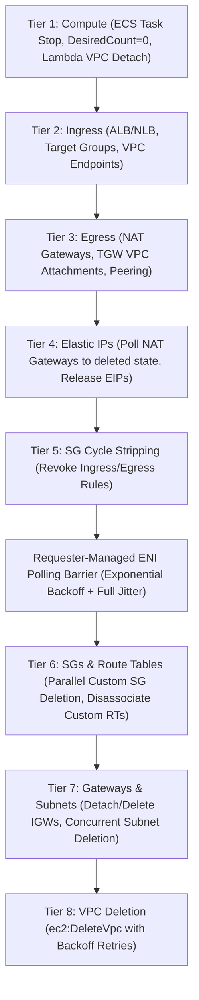

# ⚡ vpcdrain

> Deterministic, zero-dependency, single-binary Go CLI that tears down ephemeral AWS VPCs across 8 reverse-topological tiers, eliminates circular security group deadlocks, and cleanly polls requester-managed ENIs.

[](https://golang.org)
[](https://github.com/aws/aws-sdk-go-v2)
[](https://github.com/x7ssss/vpcdrain/releases)
[](LICENSE)
[](https://github.com/x7ssss/vpcdrain/actions)

---

## ⚡ Quickstart

### 🔍 Dry-Run Inspection (Terminal Formatted Plan)
```bash
vpcdrain --vpc-id vpc-0123456789abcdef0 --tag Ephemeral=true
```

### 📋 Dry-Run JSON Manifest Output
```bash
vpcdrain --vpc-id vpc-0123456789abcdef0 --tag PR=42 --account-id 123456789012 --format json
```

### 🚀 Real Teardown with Distributed DynamoDB Locking
```bash
vpcdrain \
  --vpc-id vpc-0123456789abcdef0 \
  --tag PR=42 \
  --account-id 123456789012 \
  --lock-table vpcdrain-locks \
  --emit-summary \
  --dry-run=false
```

---

## 📦 Installation & Binary Downloads

### 🚀 Pre-Built Binaries via curl (GitHub Releases)

Download the latest static binary for your operating system and architecture directly:

```bash
# Linux (x86_64)
curl -sSL -o /usr/local/bin/vpcdrain https://github.com/x7ssss/vpcdrain/releases/latest/download/vpcdrain_linux_amd64 && chmod +x /usr/local/bin/vpcdrain

# Linux (ARM64)
curl -sSL -o /usr/local/bin/vpcdrain https://github.com/x7ssss/vpcdrain/releases/latest/download/vpcdrain_linux_arm64 && chmod +x /usr/local/bin/vpcdrain

# macOS (Apple Silicon M-series)
curl -sSL -o /usr/local/bin/vpcdrain https://github.com/x7ssss/vpcdrain/releases/latest/download/vpcdrain_darwin_arm64 && chmod +x /usr/local/bin/vpcdrain

# macOS (Intel)
curl -sSL -o /usr/local/bin/vpcdrain https://github.com/x7ssss/vpcdrain/releases/latest/download/vpcdrain_darwin_amd64 && chmod +x /usr/local/bin/vpcdrain
```

### 🪟 Windows (PowerShell)
```powershell
Invoke-WebRequest -Uri "https://github.com/x7ssss/vpcdrain/releases/latest/download/vpcdrain_windows_amd64.exe" -OutFile "$Env:USERPROFILE\bin\vpcdrain.exe"
```

### 🔧 Install with Go
```bash
go install github.com/x7ssss/vpcdrain/cmd/vpcdrain@latest
```

### 🛠️ Build from Source
```bash
git clone https://github.com/x7ssss/vpcdrain.git
cd vpcdrain
CGO_ENABLED=0 go build -ldflags="-s -w" -o bin/vpcdrain ./cmd/vpcdrain
```

---

## 🏗️ 8-Tier Topological Teardown Engine

Ephemeral AWS environments (PR branches, integration sandboxes, staging clusters) leave complex dependency webs that block VPC deletion. `vpcdrain` walks the infrastructure graph in strict reverse-topological order:



| Tier | Category | Resources Swept | Teardown Strategy |
|:---:|:---|:---|:---|
| **1** | **Compute** | ECS Fargate tasks, ECS Services, Lambda VPC Attachments | Set service `desiredCount=0`, stop active tasks, clear Lambda `VpcConfig` (SubnetIds and SecurityGroupIds) to trigger Hyperplane ENI detachment |
| **2** | **Ingress** | Application/Network Load Balancers, Target Groups, VPC Endpoints | Invoke `DeleteLoadBalancer`, `DeleteTargetGroup`, and `DeleteVpcEndpoints` |
| **3** | **Egress** | NAT Gateways, Transit Gateway VPC Attachments, VPC Peering Connections | Call `DeleteNatGateway`, detach shared TGW via `DeleteTransitGatewayVpcAttachment`, delete VPC peering connections |
| **4** | **Elastic IPs** | NAT Gateway Allocated and Orphaned EIPs | Poll `DescribeNatGateways` until status reaches `deleted`, then invoke `ReleaseAddress` |
| **5** | **SG Cycle Stripping** | All Security Groups in target VPC | Revoke all `IpPermissions` (ingress) and `IpPermissionsEgress` (egress) rules to break circular dependency locks |
| **Barrier** | **ENI Drain** | Requester-managed ENIs (Lambda, ECS, ELB) | Poll `DescribeNetworkInterfaces` with exponential backoff and full jitter until 0 active interfaces remain |
| **6** | **SGs & Route Tables** | Custom Security Groups, Custom Route Tables | Delete custom SGs in parallel, disassociate and delete non-main route tables |
| **7** | **Gateways & Subnets** | Internet Gateways, Subnets | Detach IGW from VPC, call `DeleteInternetGateway`, delete all subnets concurrently |
| **8** | **VPC** | Target VPC (`vpc-xxxxxxxx`) | Call `DeleteVpc` with backoff retries |

---

## 🔒 Distributed DynamoDB Locking (Surviving CI SIGKILLs)

When CI/CD pipelines get aborted or reach hard timeouts (SIGKILL), orphaned teardown processes can leave cloud environments in broken, half-deleted states.

`vpcdrain` implements a robust distributed lock via Amazon DynamoDB:
- 🔒 **Atomic Acquisition**: Uses conditional write expressions (`attribute_not_exists(LockID) OR expires_at < :now`).
- ⏱️ **Automatic TTL Expiration**: Sets a configurable TTL (default 15 minutes). Dead runners never permanently block subsequent runs.
- 💓 **Heartbeat Renewal**: Background goroutine continuously extends the lock lease every 30 seconds while teardown proceeds.
- 🛡️ **Graceful Release**: Cleanly deletes the lock record upon successful completion or graceful shutdown (SIGINT/SIGTERM).

---

## 🔄 Two-Pass Circular Security Group Neutralization

AWS Security Groups frequently reference each other circularly (SG-A allows ingress from SG-B; SG-B allows ingress from SG-A). Calling `ec2:DeleteSecurityGroup` immediately fails with `DependencyViolation`.

`vpcdrain` solves this deterministically in two phases:
1. ✂️ **Pass 1 (Strip Rules)**: Concurrently enumerates all non-default security groups and revokes all ingress (`RevokeSecurityGroupIngress`) and egress (`RevokeSecurityGroupEgress`) rules. This breaks all circular reference edges in the graph.
2. 🗑️ **Pass 2 (Parallel Deletion)**: Concurrently deletes the bare, unlinked security groups with automatic retry backoff.

---

## 🛡️ Safety Guardrails

- 🛡️ **Scope Tagging**: Requires `--tag Key=Value` to ensure only explicitly designated ephemeral environments are targeted.
- 🔍 **Account ID Verification**: Optional `--account-id` validates the target AWS account before any mutating API calls are dispatched, preventing multi-account execution errors.
- ⚡ **Protected VPC Shield**: Refuses to delete VPCs marked with protected tags (`Production=true`, `DoNotDelete=true`, or `Protected=true`).
- 📋 **Dry-Run by Default**: Defaults to `--dry-run=true`. Never modifies AWS resources unless `--dry-run=false` is explicitly passed.

---

## 💰 FinOps Telemetry & GitHub Step Summaries

When running in CI/CD, pass `--emit-summary` to generate actionable FinOps cost reduction summaries directly into `$GITHUB_STEP_SUMMARY`:

```bash
vpcdrain --vpc-id vpc-0123456789abcdef0 --dry-run=false --emit-summary
```

### 💸 FinOps VPC Teardown Summary
| Resource Type | Count Deleted | Monthly Savings (Est.) |
|:---|:---:|:---|
| NAT Gateways | 2 | ~$65.70 / mo |
| Elastic IPs (Idle) | 2 | ~$7.30 / mo |
| Application Load Balancers | 1 | ~$22.50 / mo |
| VPC Endpoints (Interface) | 3 | ~$21.90 / mo |
| **Total Estimated Run-Rate Savings** | | **~$117.40 / mo** |

---

## 🚀 CI/CD Integration (GitHub Actions OIDC)

```yaml
name: Ephemeral VPC Teardown
on:
  pull_request:
    types: [closed]

jobs:
  cleanup:
    runs-on: ubuntu-latest
    permissions:
      id-token: write
      contents: read
    steps:
      - name: Configure AWS Credentials (OIDC)
        uses: aws-actions/configure-aws-credentials@v4
        with:
          role-to-assume: arn:aws:iam::123456789012:role/github-actions-vpcdrain
          aws-region: us-east-1

      - name: Install vpcdrain
        run: |
          curl -sSL -o /usr/local/bin/vpcdrain https://github.com/x7ssss/vpcdrain/releases/latest/download/vpcdrain_linux_amd64
          chmod +x /usr/local/bin/vpcdrain

      - name: Tear Down VPC
        run: |
          vpcdrain \
            --vpc-id ${{ steps.lookup.outputs.vpc_id }} \
            --tag PR=${{ github.event.pull_request.number }} \
            --account-id 123456789012 \
            --lock-table vpcdrain-locks \
            --emit-summary \
            --dry-run=false
```

See [examples/iam-least-privilege-policy.json](examples/iam-least-privilege-policy.json) for the minimal Resource-ARN scoped IAM policy.

---

## 📋 CLI Flag Reference

| Flag | Type | Default | Description |
|:---|:---:|:---:|:---|
| `--vpc-id` | `string` | *(required)* | Target VPC ID (e.g., `vpc-0123456789abcdef0`) |
| `--tag` | `string` | *(required)* | Scope tag in `Key=Value` format (e.g., `PR=123` or `Ephemeral=true`) |
| `--account-id` | `string` | `""` | Expected AWS Account ID to prevent cross-account blast radius |
| `--region` | `string` | ambient | AWS region (defaults to ambient AWS config or `AWS_REGION`) |
| `--lock-table` | `string` | `""` | DynamoDB table name for distributed mutex locking with TTL lease |
| `--emit-summary` | `bool` | `false` | Append FinOps cost reduction breakdown to `$GITHUB_STEP_SUMMARY` |
| `--dry-run` | `bool` | `true` | When `true`, inspects VPC, builds DAG, and outputs manifest without modifying AWS resources |
| `--format` | `string` | `terminal` | Output format: `terminal` or `json` |
| `--version` | `bool` | `false` | Print version and exit |

---

## 🛠️ Testing & Verification

```bash
# Run unit test suite
go test -v ./...

# Run unit tests with clean cache
go test -count=1 ./...

# Run code coverage analysis
go test -v -coverprofile=coverage.out ./...
go tool cover -html=coverage.out -o coverage.html
```

---

## 📄 License

This project is licensed under the MIT License - see the [LICENSE](LICENSE) file for details.

Copyright (c) 2026 x7ssss
