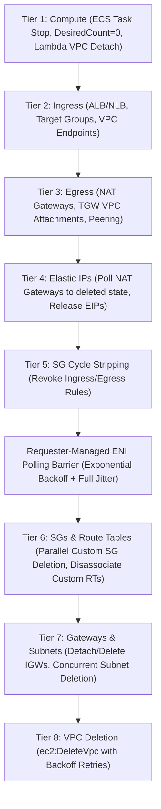

# vpcdrain

> Deterministic, zero-dependency, single-binary Go CLI that tears down ephemeral AWS VPCs across 8 reverse-topological tiers, eliminates circular security group deadlocks, and cleanly polls requester-managed ENIs.

[](https://golang.org)
[](https://github.com/aws/aws-sdk-go-v2)
[](https://github.com/x7ssss/vpcdrain/releases)
[](https://opensource.org/licenses/MIT)
[](https://github.com/x7ssss/vpcdrain/actions)

---

## ⚡ Quickstart

### Dry-Run Inspection (Terminal Formatted Plan)
```bash
vpcdrain --vpc-id vpc-0123456789abcdef0 --tag Ephemeral=true
```

### Dry-Run JSON Manifest Output
```bash
vpcdrain --vpc-id vpc-0123456789abcdef0 --tag PR=42 --account-id 123456789012 --format json
```

### Real Teardown with Distributed DynamoDB Locking
```bash
vpcdrain \
  --vpc-id vpc-0123456789abcdef0 \
  --tag PR=42 \
  --account-id 123456789012 \
  --lock-table vpcdrain-locks \
  --emit-summary \
  --dry-run=false
```

---

## 📦 Installation & Binary Downloads

### Pre-Built Binaries via curl (GitHub Releases)

Download the latest static binary for your operating system and architecture directly:

```bash
# Linux (x86_64)
curl -sSL -o /usr/local/bin/vpcdrain https://github.com/x7ssss/vpcdrain/releases/latest/download/vpcdrain_linux_amd64 && chmod +x /usr/local/bin/vpcdrain

# Linux (ARM64)
curl -sSL -o /usr/local/bin/vpcdrain https://github.com/x7ssss/vpcdrain/releases/latest/download/vpcdrain_linux_arm64 && chmod +x /usr/local/bin/vpcdrain

# macOS (Apple Silicon M-series)
curl -sSL -o /usr/local/bin/vpcdrain https://github.com/x7ssss/vpcdrain/releases/latest/download/vpcdrain_darwin_arm64 && chmod +x /usr/local/bin/vpcdrain

# macOS (Intel)
curl -sSL -o /usr/local/bin/vpcdrain https://github.com/x7ssss/vpcdrain/releases/latest/download/vpcdrain_darwin_amd64 && chmod +x /usr/local/bin/vpcdrain
```

### Windows (PowerShell)
```powershell
Invoke-WebRequest -Uri "https://github.com/x7ssss/vpcdrain/releases/latest/download/vpcdrain_windows_amd64.exe" -OutFile "$Env:USERPROFILE\bin\vpcdrain.exe"
```

### Install with Go
```bash
go install github.com/x7ssss/vpcdrain/cmd/vpcdrain@latest
```

### Build from Source
```bash
git clone https://github.com/x7ssss/vpcdrain.git
cd vpcdrain
CGO_ENABLED=0 go build -ldflags="-s -w" -o bin/vpcdrain ./cmd/vpcdrain
```

---

## 🏗️ 8-Tier Topological Teardown Engine

Ephemeral AWS environments (PR branches, integration sandboxes, staging clusters) leave complex dependency webs that block VPC deletion. `vpcdrain` walks the infrastructure graph in strict reverse-topological order:



| Tier | Category | Resources Swept | Teardown Strategy |
|:---:|:---|:---|:---|
| **1** | **Compute** | ECS Fargate tasks, ECS Services, Lambda VPC Attachments | Set service `desiredCount=0`, stop active tasks, clear Lambda `VpcConfig` (SubnetIds and SecurityGroupIds) to trigger Hyperplane ENI detachment |
| **2** | **Ingress** | Application/Network Load Balancers, Target Groups, VPC Endpoints | Invoke `DeleteLoadBalancer`, `DeleteTargetGroup`, and `DeleteVpcEndpoints` |
| **3** | **Egress** | NAT Gateways, Transit Gateway VPC Attachments, VPC Peering Connections | Call `DeleteNatGateway`, detach shared TGW via `DeleteTransitGatewayVpcAttachment`, delete VPC peering connections |
| **4** | **Elastic IPs** | NAT Gateway Allocated and Orphaned EIPs | Poll `DescribeNatGateways` until status reaches `deleted`, then invoke `ReleaseAddress` |
| **5** | **SG Cycle Stripping** | All Security Groups in target VPC | Revoke all `IpPermissions` (ingress) and `IpPermissionsEgress` (egress) rules to break circular dependency locks |
| **Barrier** | **ENI Drain** | Requester-managed ENIs (Lambda, ECS, ELB) | Poll `DescribeNetworkInterfaces` with exponential backoff and full jitter until 0 active interfaces remain |
| **6** | **SGs & Route Tables** | Custom Security Groups and Custom Route Tables | Concurrently delete custom SGs via `errgroup` (skip default SG). Disassociate and delete custom route tables (skip main RT) |
| **7** | **Gateways & Subnets** | Internet Gateways and Subnets | Detach and delete Internet Gateways. Concurrently delete all subnets via `errgroup` |
| **8** | **VPC Deletion** | Target VPC | Execute `DeleteVpc` with resilient backoff retries until completion |

---

## 🔒 Distributed DynamoDB Locking (Surviving CI SIGKILLs)

When running multiple teardown jobs concurrently in CI/CD, race conditions and duplicate teardowns can corrupt AWS state. When `--lock-table <name>` is provided, `vpcdrain` uses DynamoDB for atomic distributed mutex locking:

- **Partition Key**: `LockID = <vpc-id>`
- **Condition Expression**:
  ```
  attribute_not_exists(LockID) OR ExpiresAt < :now
  ```
- **Surviving Runner SIGKILL**: Each lock carries an atomic TTL lease (default: 50 minutes). If a GitHub Actions runner gets cancelled, killed, or runs out of memory, the lease automatically expires, preventing orphaned locks.
- **Deterministic Cleanup**: `defer locker.ReleaseLock()` ensures the lock is immediately released on normal exit, SIGINT, or SIGTERM.

---

## 🔄 Two-Pass Circular Security Group Neutralization

AWS security groups frequently cross-reference each other (SG-A allows ingress from SG-B, while SG-B allows ingress from SG-A). AWS rejects deletion attempts on either group with `DependencyViolation`.

`vpcdrain` solves this via a two-pass algorithm (`internal/engine/security_groups.go`):

1. **Pass 1 (Neutralize)**: Queries all custom security groups in the VPC (skipping `default`). Revokes every ingress and egress rule, stripping all edges from the dependency graph.
2. **Pass 2 (Eradicate)**: Concurrently invokes `DeleteSecurityGroup` across all custom SGs using `errgroup` with resilient exponential backoff and full jitter.

---

## 🛡️ Safety Guardrails

`vpcdrain` enforces strict safety invariants before inspecting or touching any AWS resources:

1. **Caller Verification**: Calls `sts:GetCallerIdentity`. If the caller account does not match `--account-id`, execution aborts immediately to prevent cross-account blast radius.
2. **Hard Denylist**: Inspects VPC tags. If `Environment` (or `Env`) matches `production`, `prod`, `staging`, `shared`, or `core` (case-insensitive), or if the `DoNotDelete` tag is present, execution aborts immediately.
3. **Scope Tag Exact Match**: Ensures the VPC has the exact tag provided via `--tag Key=Value` (e.g., `PR=123`).
4. **Shared Transit Gateway Protection**: `vpcdrain` never calls `DeleteTransitGateway`. Only VPC attachments specific to this VPC are detached via `DeleteTransitGatewayVpcAttachment`.

---

## 💰 FinOps Telemetry & GitHub Step Summaries

Tracks destroyed resources and computes monthly and annualized prevented cloud waste:

| Billable Resource Category | Monthly Unit Rate | Basis |
| :------------------------- | :---------------: | :---- |
| **NAT Gateways** | $32.85 / month | $0.045 / hour |
| **Elastic IPs (IPv4)** | $3.65 / month | $0.005 / hour IPv4 charge |
| **Application / Network Load Balancers** | $18.25 / month | $0.025 / hour |
| **Running Workloads (EC2 / Fargate)** | $40.00 / month | Baseline compute workload |
| **VPC Interface Endpoints** | $7.30 / month | $0.010 / hour |

When running in GitHub Actions (or with `--emit-summary`), a formatted Markdown summary table is appended to `$GITHUB_STEP_SUMMARY`:

```markdown
## 💸 FinOps VPC Teardown Summary

> **Target VPC:** `vpc-0123456789abcdef0` | **Region:** `us-west-2` | **Account:** `123456789012`

| Billable Resource Category | Destroyed | Unit Monthly Rate | Monthly Savings | Annualized Savings |
| :------------------------- | :-------: | :---------------: | :-------------: | :----------------: |
| **NAT Gateways** | 2 | $32.85 | **$65.70** | $788.40 |
| **Elastic IPs (IPv4)** | 2 | $3.65 | **$7.30** | $87.60 |
| **Application / Network Load Balancers** | 1 | $18.25 | **$18.25** | $219.00 |
| **VPC Interface Endpoints** | 2 | $7.30 | **$14.60** | $175.20 |
| **Total Prevented Cloud Waste** | | | **$105.85 / mo** | **$1270.20 / yr** |

💰 **Total Monthly Savings:** **$105.85** ($1270.20 annualized)
```

---

## 🚀 CI/CD Integration (GitHub Actions OIDC)

Add automated teardown to your repository upon PR close (`.github/workflows/teardown.yml`):

```yaml
name: Ephemeral VPC Teardown

on:
  pull_request:
    types: [closed]

permissions:
  id-token: write
  contents: read

jobs:
  teardown:
    name: Teardown Ephemeral VPC
    runs-on: ubuntu-latest
    timeout-minutes: 50

    steps:
      - name: Checkout Code
        uses: actions/checkout@v4

      - name: Configure AWS Credentials via OIDC
        uses: aws-actions/configure-aws-credentials@v4
        with:
          role-to-assume: arn:aws:iam::123456789012:role/github-actions-vpcdrain
          aws-region: us-west-2
          role-session-name: vpcdrain-pr-${{ github.event.pull_request.number }}

      - name: Download vpcdrain
        run: |
          curl -sSL -o /usr/local/bin/vpcdrain https://github.com/x7ssss/vpcdrain/releases/latest/download/vpcdrain_linux_amd64
          chmod +x /usr/local/bin/vpcdrain

      - name: Discover Target VPC
        id: vpc
        run: |
          VPC_ID=$(aws ec2 describe-vpcs \
            --filters "Name=tag:PR,Values=${{ github.event.pull_request.number }}" \
            --query "Vpcs[0].VpcId" \
            --output text)

          if [ "$VPC_ID" == "None" ] || [ -z "$VPC_ID" ]; then
            echo "found=false" >> $GITHUB_OUTPUT
            exit 0
          fi

          echo "found=true" >> $GITHUB_OUTPUT
          echo "vpc_id=$VPC_ID" >> $GITHUB_OUTPUT

      - name: Execute Deterministic Teardown
        if: steps.vpc.outputs.found == 'true'
        run: |
          vpcdrain \
            --vpc-id "${{ steps.vpc.outputs.vpc_id }}" \
            --tag "PR=${{ github.event.pull_request.number }}" \
            --account-id "123456789012" \
            --region "us-west-2" \
            --lock-table "vpcdrain-locks" \
            --emit-summary \
            --dry-run=false
```

See [examples/iam-least-privilege-policy.json](examples/iam-least-privilege-policy.json) for the minimal Resource-ARN scoped IAM policy.

---

## 📋 CLI Flag Reference

| Flag | Type | Default | Description |
|:---|:---:|:---:|:---|
| `--vpc-id` | `string` | *(required)* | Target VPC ID (e.g., `vpc-0123456789abcdef0`) |
| `--tag` | `string` | *(required)* | Scope tag in `Key=Value` format (e.g., `PR=123` or `Ephemeral=true`) |
| `--account-id` | `string` | `""` | Expected AWS Account ID to prevent cross-account blast radius |
| `--region` | `string` | ambient | AWS region (defaults to ambient AWS config or `AWS_REGION`) |
| `--lock-table` | `string` | `""` | DynamoDB table name for distributed mutex locking with TTL lease |
| `--emit-summary` | `bool` | `false` | Append FinOps cost reduction breakdown to `$GITHUB_STEP_SUMMARY` |
| `--dry-run` | `bool` | `true` | When `true`, inspects VPC, builds DAG, and outputs manifest without modifying AWS resources |
| `--format` | `string` | `terminal` | Output format: `terminal` or `json` |
| `--version` | `bool` | `false` | Print version and exit |

---

## 🛠️ Testing & Verification

```bash
# Run unit test suite
go test -v ./...

# Run unit tests with clean cache
go test -count=1 ./...

# Run code coverage analysis
go test -v -coverprofile=coverage.out ./...
go tool cover -html=coverage.out -o coverage.html
```

---

## 📄 License

MIT License. See [LICENSE](LICENSE) for details.
